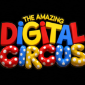

<p align="center">
  
</p>

<h1 align="center">The Amazing Digital Circus — Fangame</h1>

<p align="center">
  A fan-made game inspired by <strong>The Amazing Digital Circus</strong>, built with <a href="https://haxeflixel.com">HaxeFlixel</a>.
</p>

<p align="center">
  
  
  
  
</p>

---

## About

This project is a non-commercial fan game inspired by **The Amazing Digital Circus**, built using HaxeFlixel. It targets both desktop and Android, with a custom intro cutscene, full audio engine, and asset pipeline built from the ground up.

## Features

- Cross-platform support: Windows, Linux, macOS, and Android
- Video intro powered by `hxvlc`
- Custom audio engine with bus mixing, ducking, pooling, and beat detection
- Mobile-friendly input handling (touch controls, on-screen prompts)
- Automated CI builds via GitHub Actions

## Tech Stack

| Component   | Version |
|-------------|---------|
| Haxe        | 4.3.7   |
| HaxeFlixel  | 5.9.0   |
| OpenFL      | 9.4.0   |
| Lime        | 8.2.2   |
| hxcpp       | 4.3.2   |
| hxvlc       | 1.8.0   |

## Building

```bash
haxelib install hmm
haxelib run hmm install
```

### Desktop

```bash
haxelib run lime build windows -release
haxelib run lime build linux -release
haxelib run lime build mac -release
```

### Android

```bash
haxelib run lime setup android
haxelib run lime build android -release
```

Android builds require NDK r21e, SDK platform 34, and build-tools 34.0.0. See `.github/workflows` for the full CI configuration.

## Project Structure

```
source/
  audio/        Audio playback helpers
  audio/master/ Advanced audio engine (buses, ducking, pooling)
  backend/      Paths and core utilities
  intro/        Intro video state
  states/       Game states (menu, gameplay)
arts/           Icons and source art
assets/         Images, audio, video, and data used at runtime
```

## License

Licensed under the [Apache-2.0 License](LICENSE).

This is an unofficial fan project. **The Amazing Digital Circus** and all related characters and assets are property of their respective owners. This project is not affiliated with or endorsed by the original creators.
